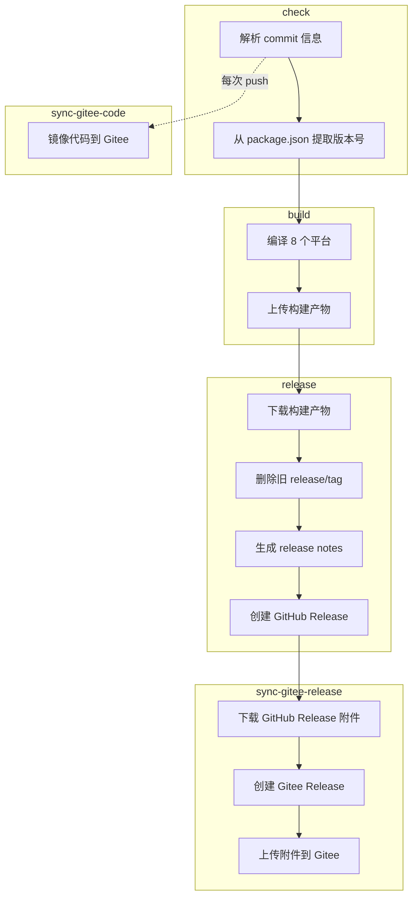

# 构建与发布工作流

## 📋 概述

本目录包含项目的 CI/CD 配置，主工作流定义在 `build-go-renderer.yml` 中。

整个流水线完全由 **commit 信息中的关键词** 驱动。推送到 `main` / `master` 分支时，只需在 commit message 中包含对应关键词，GitHub Actions 会自动完成后续工作。

---

## 🔑 关键词

| Commit 信息中的关键词 | 构建（8 平台） | GitHub Release | 同步到 Gitee Release |
|----------------------|:---:|:---:|:---:|
| （无关键词） | ❌ | ❌ | ❌ |
| `build go action` | ✅ | ❌ | ❌ |
| `build go release` | ✅ | ✅ | ✅ |
| Pull Request | ✅ | ❌ | ❌ |

> **说明：** Pull Request 始终会触发构建（不会发布）。PR 中 commit message 的关键词会被**忽略**——工作流会无条件设置 `should_build=true`、`should_release=false`，并跳过关键词解析。

> **说明：** 代码同步到 Gitee（`sync-gitee-code`）在**每次 push 时自动运行**，无需关键词。

---

## 🚀 用法示例

```bash
# ============================================================
# 仅构建，验证所有平台编译是否通过
# ============================================================
git commit -m "fix: update renderer logic (build go action)"

# ============================================================
# 构建 + 创建 GitHub Release + 同步到 Gitee Release
# ============================================================
git commit -m "chore: release version 0.4.1 (build go release)"

# ============================================================
# 常规 commit（不需要构建和发布）
# ============================================================
git commit -m "docs: update README"
git commit -m "fix: resolve rendering issue"
git commit -m "feat: add dark mode support"

# ============================================================
# 手动触发（无需 commit）
# ============================================================
# 前往 GitHub → Actions → Build Go Renderer → Run workflow
```

> **注意：** 版本号自动从根目录 `package.json` 的 `version` 字段中提取，无需手动指定。

---

## 🏗️ 构建目标 (Go)

| 平台 | 架构 | GOOS/GOARCH | 说明 |
|------|:---:|-------------|------|
| Linux | x64 | `linux/amd64` | 纯 Go 静态编译，主要用于大部分云服务器和桌面 Linux（x86_64 市场主流） |
| Linux | ARM64 | `linux/arm64` | 纯 Go 交叉编译，主要用于 ARM64 服务器 / 单板机（树莓派、Oracle Cloud ARM 等） |
| macOS | Intel | `darwin/amd64` | 纯 Go 交叉编译，主要用于 Intel Mac（2020 年及更早的老款 Mac） |
| macOS | Apple Silicon | `darwin/arm64` | 纯 Go 交叉编译，主要用于 M 系列芯片的 Mac（2020 年末至今的所有新款 Mac） |
| Windows | x64 | `windows/amd64` | 纯 Go 交叉编译，主要用于一般 Windows 桌面（桌面市场主流） |
| Windows | ARM64 | `windows/arm64` | 纯 Go 交叉编译，主要用于 ARM Windows 设备（高通骁龙 X Elite/Plus 笔记本、Surface Pro X 等） |
| Android | ARM64 | `android/arm64` | `CGO_ENABLED=0` 纯 Go 静态编译，主要用于 Termux（ARM 手机 / 平板） |
| Android | x64 | `android/amd64` | `CGO_ENABLED=0` 纯 Go 静态编译，主要用于模拟器 / Chromebook（Termux） |

> **说明：** 所有 8 个平台均在同一个 Ubuntu runner 上通过 Go 交叉编译完成，只需设置 `GOOS` / `GOARCH` 环境变量，无需 NDK、MSVC 等外部工具链。Android 目标额外设置 `CGO_ENABLED=0` 以确保纯静态链接。

---

## 📦 流水线阶段

```
check ──→ build ──→ release ──→ sync-gitee-release
  │         │         │           │
  │         │         │           ├─ 下载 GitHub Release 附件
  │         │         │           ├─ 通过 Gitee API 创建 Release
  │         │         │           └─ 上传所有二进制附件到 Gitee
  │         │         │
  │         │         ├─ 下载构建产物
  │         │         ├─ 删除旧 release/tag
  │         │         ├─ 生成 release notes
  │         │         └─ 创建 GitHub Release
  │         │
  │         ├─ 编译 8 个平台目标
  │         └─ 上传构建产物 (Artifact)
  │
  └─→ sync-gitee-code（与 check 并行，每次 push 触发）
       通过 hub-mirror-action 镜像所有分支/标签到 Gitee
```



---

## 🔄 Gitee 同步

自动将代码和 Release 镜像到 [Gitee](https://gitee.com/vincent-zyu/koishi-plugin-wydashen-guangyi-query)（方便国内用户下载）。

### sync-gitee-code — 代码镜像

**每次 push 时自动运行**（与 `check` job 并行）：
- 使用 [Yikun/hub-mirror-action](https://github.com/Yikun/hub-mirror-action) 镜像所有分支、标签和提交到 Gitee
- 无需关键词，自动触发

### sync-gitee-release — Release 镜像

**在 `release` job 成功后运行**：
1. 从 GitHub Release 下载所有附件（8 个平台的二进制文件）
2. 通过 Gitee API 在 Gitee 上创建对应的 Release
3. 将所有二进制附件上传到 Gitee Release
4. 支持重试机制（每个文件最多 3 次，超时 20 分钟）

---

## ⚙️ 前置条件（Gitee 同步所需的准备工作）

要让 GitHub Actions 自动同步代码和 Release 到 Gitee，需要配置以下 Secrets：

### 📌 需要设置的 Secrets 汇总

| Secret 名称 | 用途 | 获取方式 |
|-------------|------|----------|
| `GITEE_PRIVATE_KEY` | 通过 SSH 推送代码到 Gitee（代码镜像） | 生成 SSH 密钥对 |
| `GITEE_TOKEN` | 通过 Gitee API 创建 Release 和上传附件 | Gitee 个人访问令牌 |

### 🔑 第一步：生成 SSH 密钥对（用于 `GITEE_PRIVATE_KEY`）

SSH 密钥用于 `sync-gitee-code` job，让 GitHub Actions 能通过 SSH 推送代码到 Gitee。

```bash
# 1. 在本地生成一个新的 SSH 密钥对（推荐 ed25519 算法）
ssh-keygen -t ed25519 -C "github-actions-sync-go-renderer" -f ~/.ssh/gitee_sync_go_renderer -N ""

# 2. 会生成两个文件：
#    ~/.ssh/gitee_sync_go_renderer       ← 私钥（给 GitHub 用）
#    ~/.ssh/gitee_sync_go_renderer.pub   ← 公钥（给 Gitee 用）

# 3. 查看私钥内容（复制到 GitHub）
cat ~/.ssh/gitee_sync_go_renderer

# 4. 查看公钥内容（复制到 Gitee）
cat ~/.ssh/gitee_sync_go_renderer.pub
```

**把公钥添加到 Gitee：**

1. 打开 [Gitee SSH 公钥设置](https://gitee.com/profile/sshkeys)
2. 点击 **添加公钥**
3. 标题填 `github-actions-sync-go-renderer`（随意）
4. 粘贴 `~/.ssh/gitee_sync_go_renderer.pub` 的内容
5. 点击 **确定**

**把私钥添加到 GitHub：**

1. 打开 GitHub 仓库 → **Settings** → **Secrets and variables** → **Actions**
2. 点击 **New repository secret**
3. Name 填 `GITEE_PRIVATE_KEY`
4. Value 粘贴 `~/.ssh/gitee_sync_go_renderer` 的完整内容（包含 `-----BEGIN` 和 `-----END` 行）
5. 点击 **Add secret**

### 🔑 第二步：创建 Gitee 个人访问令牌（用于 `GITEE_TOKEN`）

Gitee Token 用于 `sync-gitee-code`（镜像仓库）和 `sync-gitee-release`（创建 Release、上传附件）。

1. 打开 [Gitee 个人访问令牌页面](https://gitee.com/profile/personal_access_tokens)
2. 点击 **生成新令牌**
3. 描述填 `github-actions-sync-go-renderer`（随意）
4. 权限勾选：
   - ✅ `projects`（项目/仓库相关操作）
   - ✅ `pull_requests`（如果需要 PR 同步）
   - ✅ `issues`（如果需要 Issue 同步）
   - 其他按需勾选
5. 点击 **提交**，复制生成的 Token（**只会显示一次！**）

**把 Token 添加到 GitHub：**

1. 打开 GitHub 仓库 → **Settings** → **Secrets and variables** → **Actions**
2. 点击 **New repository secret**
3. Name 填 `GITEE_TOKEN`
4. Value 粘贴刚才复制的 Gitee Token
5. 点击 **Add secret**

### 🔑 第三步：确保 Gitee 上的仓库已存在

`hub-mirror-action` 需要目标仓库已存在（不会自动创建）：

1. 打开 [Gitee](https://gitee.com/)
2. 创建一个仓库，仓库名必须与 GitHub 一致：`koishi-plugin-wydashen-guangyi-query`
3. 仓库可以是空的，后续会被 GitHub 的内容覆盖

### ✅ 第四步：验证配置

配置完成后，可以用一个空 commit 触发工作流来验证：

```bash
# 仅触发代码同步（每次 push 自动运行）
git commit --allow-empty -m "ci: test gitee sync"
git push

# 触发完整流程：构建 + Release + Gitee 同步
git commit --allow-empty -m "ci: test full pipeline (build go release)"
git push
```

然后在 GitHub → **Actions** 页面查看运行结果：
- `【Gitee码云】Sync Code Commit` → 代码同步是否成功
- `【Gitee码云】Sync Release File` → Release 同步是否成功

### 🔧 常见问题

| 问题 | 原因 | 解决方案 |
|------|------|----------|
| `sync-gitee-code` 失败，提示 SSH 认证失败 | SSH 密钥配置有误 | 检查公钥是否添加到了 Gitee，私钥是否完整复制到了 GitHub Secret |
| `sync-gitee-release` 失败，提示 401 | Gitee Token 无效或过期 | 重新生成 Gitee 个人访问令牌并更新 GitHub Secret |
| `sync-gitee-release` 上传附件失败 | Gitee 上传速度慢（约 10KB/s），文件大可能超时 | 工作流已内置重试机制（3 次 × 20 分钟超时），一般会成功 |
| Gitee 仓库内容没更新 | `hub-mirror-action` 使用 `force_update: true`，但仓库可能不存在 | 确保 Gitee 上已创建同名仓库 |

---

## 📌 版本号

版本号自动从根目录 `package.json` 的 `"version"` 字段中提取，用于：
- Release 标签名（如 `v0.4.1-beta.6`）
- 产物文件名（如 `wing-renderer-linux-amd64-v0.4.1-beta.6`）
- Release Notes 中的版本信息

> 无需手动指定版本号，只需确保 `package.json` 中的 `version` 字段已更新即可。
