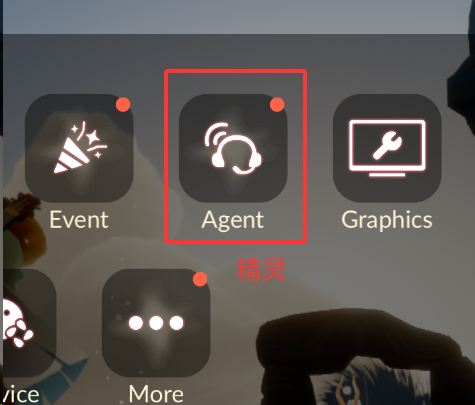
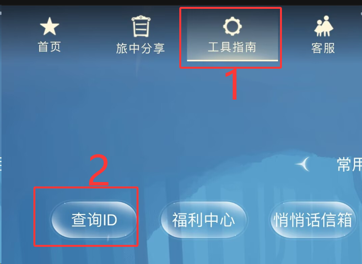

# ✨ 网易国服 Sky 光遇 - 游戏ID查询方法

## 📱 获取游戏ID的三个步骤

### 第一步：打开游戏设置 ⚙️

在游戏内点击右上角的"齿轮图标"（设置按钮）

💡 提示：齿轮图标位于游戏界面的右上角

---

### 第二步：选择"精灵"选项 🎧

在设置菜单中，右划选择"精灵"选项

💡 提示：头像是个耳机的那个，不要和音频设置搞混了(

---

### 第三步：查看游戏ID 🔍

点击"查询ID"按钮，即可看到你的游戏ID

💡 然后长按复制这个ID，用于查询你的光翼收集情况

---

✨ 祝你在光遇世界中收集到所有光翼！✨

