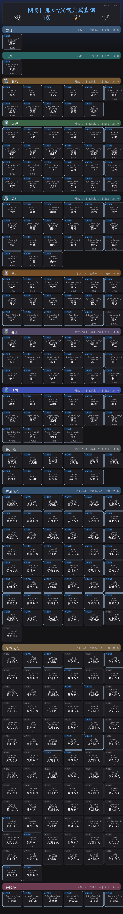

# koishi-plugin-wydashen-guangyi-query 🕊️

 

查询**光遇国服**玩家的**光翼（Winged Light）**获取情况，支持 **Puppeteer** 和 **Go** 双渲染引擎。

输入玩家角色ID，即可生成一张光翼收集情况的图片，按地图分类展示已收集与未收集的光翼。

<del>💬 插件使用问题 / 🐛 Bug反馈 / 👨‍💻 插件开发交流，欢迎加入QQ群：<b>259248174</b> 🎉（这个群G了</del>

💬 插件使用问题 / 🐛 Bug反馈 / 👨‍💻 插件开发交流，欢迎加入QQ群：<b>1085190201</b> 🎉

🤖 Nonebot Koishi Zerobot... py js go... sky光遇bot交流qq群：<b>475328908</b>

💡 在群里直接艾特我，回复的更快哦~ ✨

> ⚠️ 如果查询光翼的后端挂了，请到群里找 **vincentzyu** 反馈~

 

**Go 渲染器下载 (支持 Windows / Linux / macOS - x86 / ARM)**

---

## ⚡ 双引擎渲染

本插件支持两种渲染方式：

- **Puppeteer 渲染** — 默认方式，需要 puppeteer 服务，效果精美
- **Go 渲染器** — 可选方式，无需 Puppeteer，性能更高，支持深色模式

---

## 🎮 指令

| 指令 | 说明 |
| --- | --- |
| `查询光翼 <角色ID>` | 使用 Puppeteer 渲染图片返回光翼收集情况 |
| `查询光翼-go <角色ID>` | 使用 Go 渲染器渲染（性能更高 ⚡） |
| `查询光翼-forward <角色ID>` | 以合并转发消息返回（仅 OneBot 平台） |
| `获取id方法` | 查看如何获取自己的角色ID |
| `刷新光翼` | 手动刷新光翼映射数据 |

### 查询光翼 \<玩家id\>
> 返回结果

### 查询光翼-go \<玩家id\>
> 返回结果

### 获取id方法
> 返回结果

---

## 📚 更多文档

| 文档 | 说明 |
|------|------|
| [📡 API 文档](doc/api.md) | 后端 API 端点说明 |
| [🔧 构建与发布工作流](.github/workflows/build-go-renderer.md) | CI/CD 流水线说明、关键词触发、Gitee 同步配置 |
